**Serveis de directori. LDAP**

**25/09/2025** 

**Marc Melendo Vicens**

Per començar haurem de configurar la infraestructura del servidor, en aquest cas començarem modificant el hostname en el archiu /etc/hosts amb sudo nano

Editarem la segona línia de comanda en el qual en primer lloc modificarem el host name col·locant server.innovatechXX.test on XX és el numero de llista i despres escriurem server

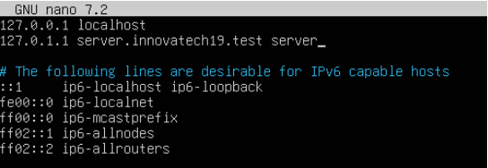

A continuació configurarem els 2 adaptadors de xarxa que tenim, el primer el adaptador nat que està per defecte i el segon colocar-em el adaptador host only

Per començar hem d’activar-lo abans de iniciar la máquina

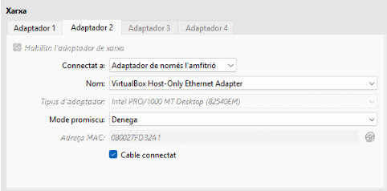

Un cop fet això modificarem l’arxiu de xarxa fent sudo nano /etc/netplan/ (tabular per completar, només hi ha 1 arxiu)

El primer adaptador esta configurat de fabrica, el segon sera el enp0s8 on activar-em el dhcp per tindre una ip de forma automatica. Un cop guardat farem sudo netplan apply per guardar la nova configuració

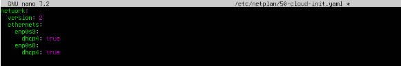

Ara instalarem el OpenLDAP aixo ho farem amb la seguent comanda

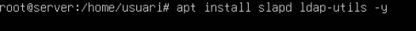

Un cop fet això s’obrira un menu que haurem de seguir i ens demanara una contrasenya, en aquest cas el client ens demana fer servir la contrasenya p@ssw0rd

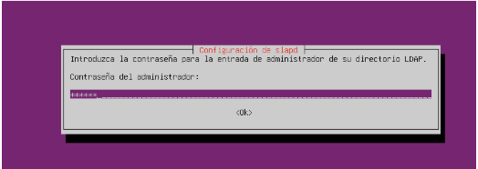

Un cop fet això farem system status slapd per verificar que funciona correctament

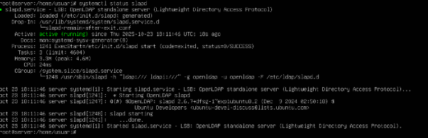

I amb slapcat podem verificar si hem configurat correctament tot si hi ha alguna cosa que no surt com hauria de sortir podem fer dpkg-reconfigure slapd per tornar a configurar-lo

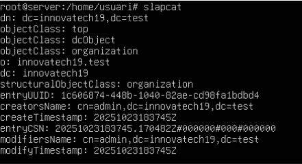

Un cop que hem verificat tot esta correcta haurem de crear els 2 OUs una de users i una de groups tal i com ens demana el client.

Per fer això ho farem amb un arxiu .ldif per començar farem l’arxiu amb sudo nano OU\_users.ldif, un cop obert colocarem ho colocarem tal i com esta a la imatge

sempre canviarem els dc depenen del nostre domini i el ou per escollir el nom del OU

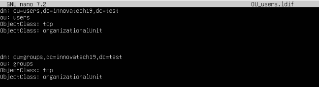

Un cop que hem creat correctament l’arxiu tocara crear els grups, aixo ho farem col·locant la següent comanda 

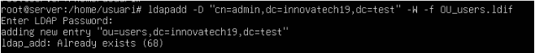

Ens demana la contrasenya i un cop fet això ja tindrem les OUs creades

Per poder validar que les OUs estan creades correctament amb la comanda de ldapsearch, ho col·locarem tal i com esta a la imatge per aixi buscar unicament les OUs del domini innovatech.test

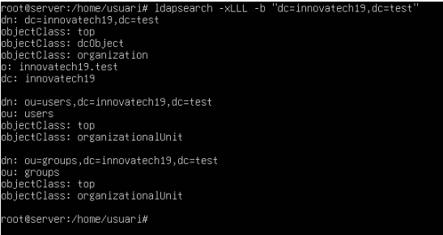

Ara seguirem amb l'ús de LAM, per començar haurem d'instal·lar-lo amb la següent comanda

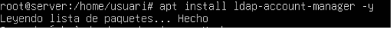

Un cop fet això haurem d’anar al buscador i colocar la ip del nostre adaptador host only en el seguit de /lam , en el meu cas podem veure que la nostre ip és 192.168.56.101/24 per tant en el buscador haurem de col·locar 192.168.56.101/lam en el buscador de google.

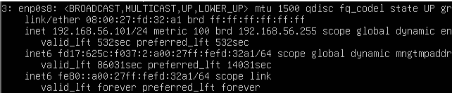

Un cop aquí hem d’anar a la part de LAM configuration  que hi ha a la part superior dreta

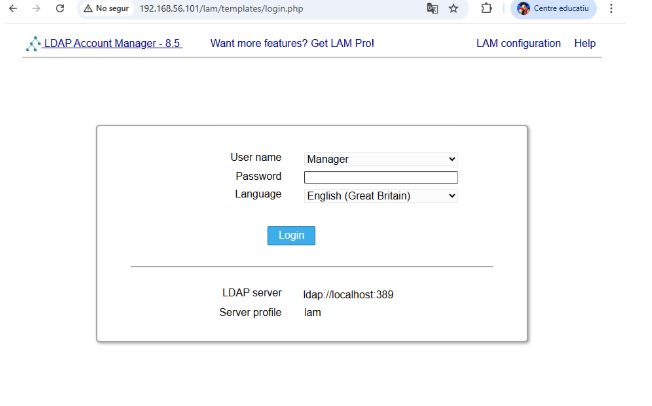

Un cop que ja estem dins escollim la segona opció per editar els perfils

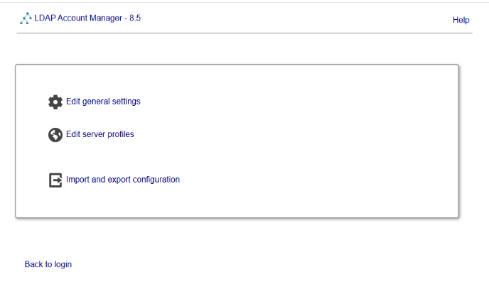

Quan estem dins haurem d’iniciar sesió, en aquest cas la conta sempre ser lam amb la contrasenya lam

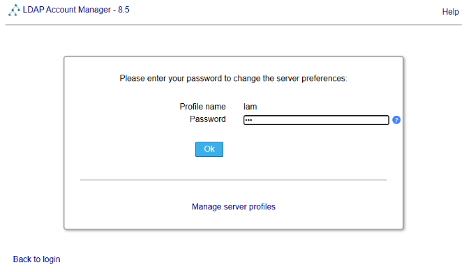

Un cop que hem pogut inicar sesió haurem de modificar els parametres per tal i que s’adaptin al nostre domini, en el meu cas quedara algo aixi.

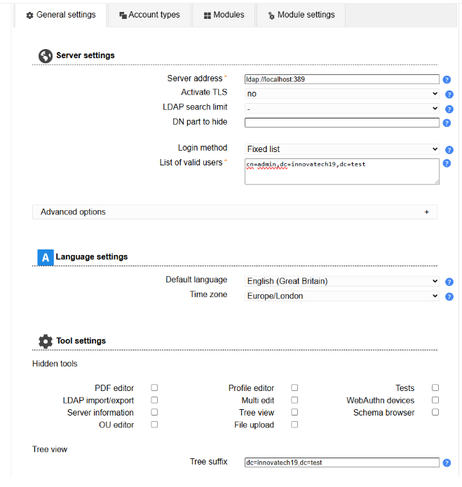

I a la segona pestanya de account types haurem de modificar-ho amb els noms que hem fet servir anteriorment, en meu cas quedara algo com aixi

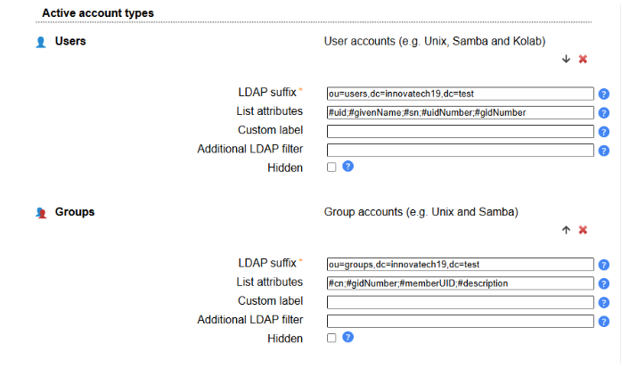

Un cop que hem fet tot això escollirem l'opció de guardar que hi ha abaix de tot

Un cop fet això tornarem a la pàgina d’inici en la qual podrem veure que els user name ha canviat a admin, i la contrasenya que haurem de col·locar per poder entrar a en aquest cas és p@ssw0rd

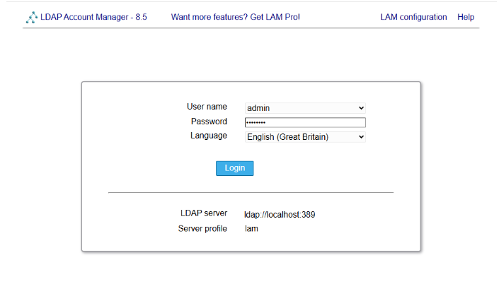

Un cop que estem dins anirem a l’apartat de grups

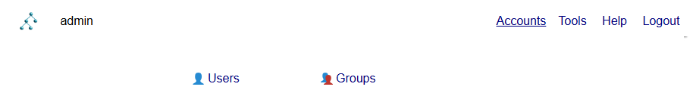

Un cop dins haurem de crear un nou grup el primer grup és dira tech que sera per els tècnics i un altre que sera manager.

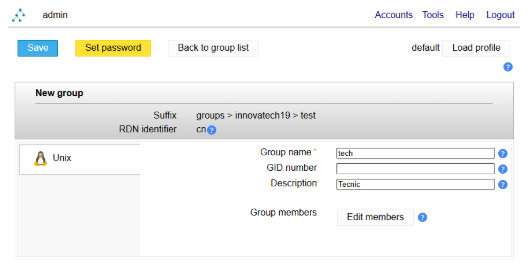

 Un cop fet això haura de quedar algo com així

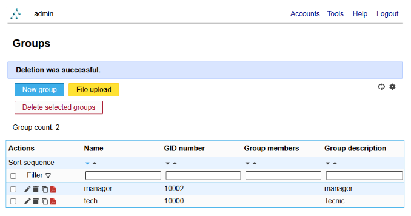

Un cop que ja tenim els grups creats, haurem de crear els 2 usuaris, la part d’usuaris te 2 parts que haurem de modificar la primera será la personal que ho podem deixar tal i com està a la foto, que será únicament per colocar els noms obligatoris

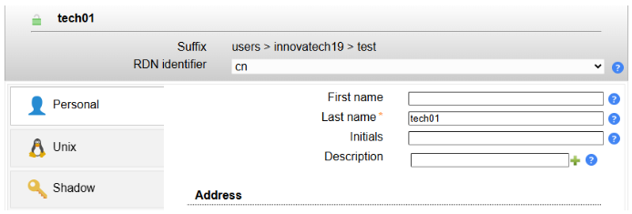

I el segon apartat sera Unix on colocarem el nom que ens demana en aquest cas sera tech01 i ara vindra un pas important.

Hem de crear un grup primari amb el mateix nom, cosa que ja ens dóna l'opció fent un sol click al buto que posa “crear un grup amb el mateix nom” 

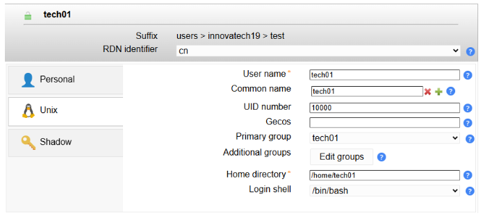

un cop fet això tambe haurem d’afegir com a grups secundari tech quedant algo aixi 

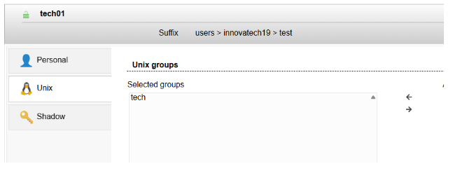

Ara com a part extra colocarem la contrasenya que sera 1234  fent click a la part set password 

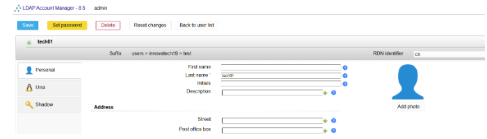

Escollirem  la opcio de forçar un canvi de contrasenya perque aixi l’usuari canvi la contrasenya al entrar

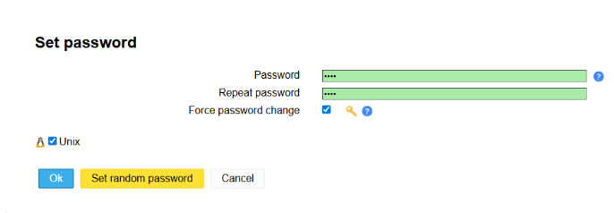

Ara haurem de tornar a repetir el procés però amb l’usuari de manager01, ens hauria de quedar un resultat com aquest en la part d’usuaris 

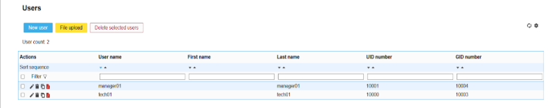

I  en els grups, en aquest cas tenim 4 grups els 2 pricipals de cada usuari que son manager01 i tech01, i els 2 grups que hem creat abans manager i tech

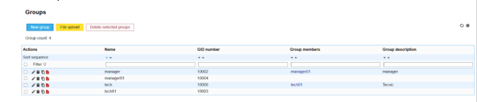

Un cop fet això continuarem amb la màquina client, en aquest cas sera una màquina Zorin on haurem de configurar la segon interfície de xarxa com host only i configurar-la, en aquest cas ja ven configurada per defecte gràcies al servei DHCP

Un cop fet això tocara configurar el arxiu de host, hem d’editar aquest fitxer ja que no tenim un servei de dns

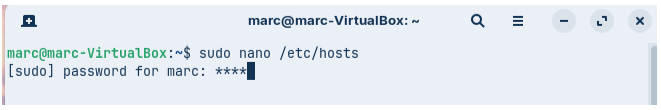

Haurem de modificar el fitxer perque ens quedi d’aquesta forma

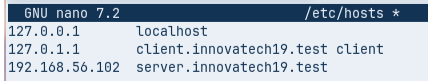

Per defecte la 3r línia no està per tant haurem d’afegir, la ip que colocarem serà la ip que tingui el interfície de xarxa de host only, aquesta ip la podrem saber fent ip a

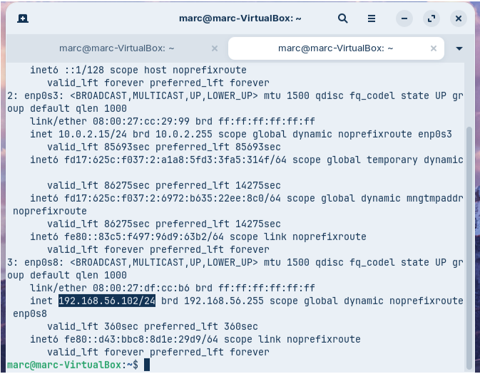

Avans de confirmar que tot funciona correctament haurem de modificar l’arxiu /etc/hostname amb la comanda sudo nano /etc/hostname un cop que tenim els 2 fitxers guardats haurem de reinciar la maquina per aplicar els canvis.

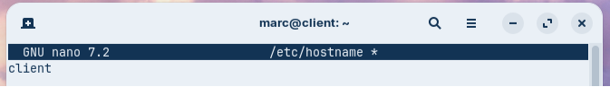

Un cop fet tot això guardarem el fitxer de host i comprovarem que tot funciona correctament amb la comanda hostname \-f per veure el nom del host i amb la comanda dig(domini) en el meu cas sera dig server.innovatech19.test

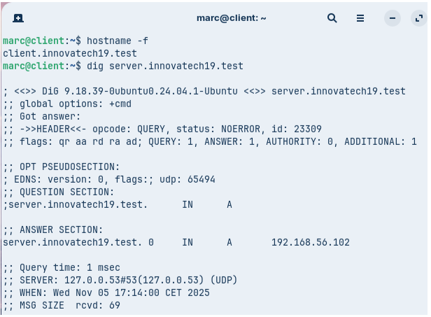

Un cop fet aixo haurem d’instalar els paquets necesaris amb la seguent comanda

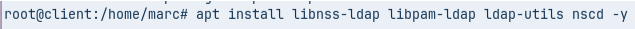

 

Un cop que hem instalat els paquets sortira la segunet pestanya la qual la editarem tal i com esta a la imatge pero modificant el domini

Seguim amb la insalació colocant el nostre domini 

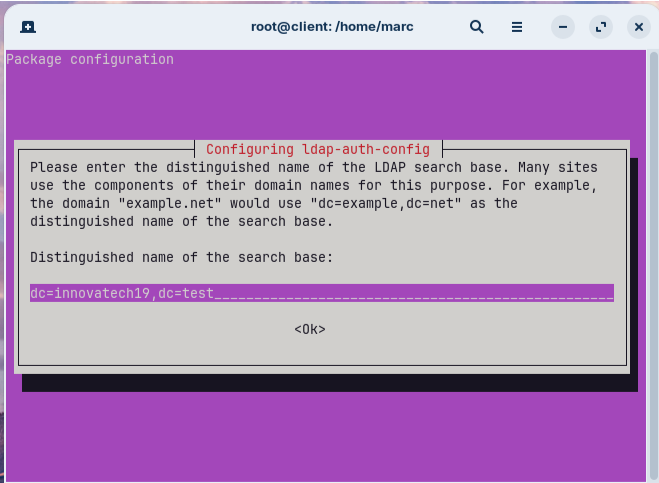

Escollim la versió 3 del protocal del LDAP

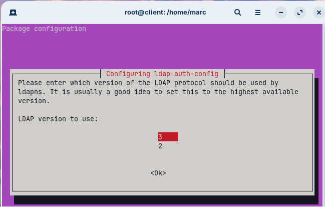

Continuem escollint les seguents opcions

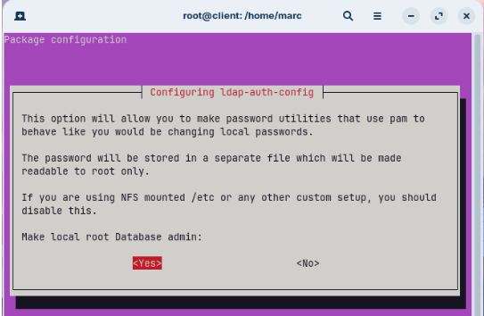

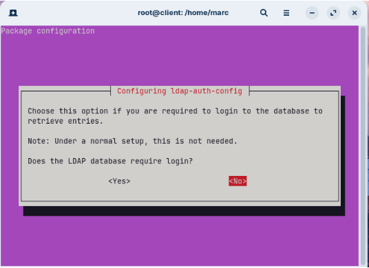

Aqui hem de col·locar l’usuari administrador del nostre domini i el domini

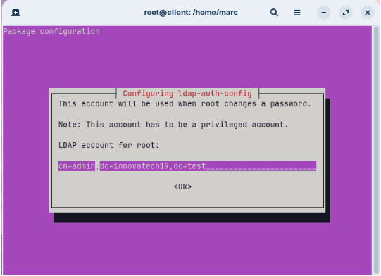

Tot seguit col·loquem la nostre contrasenya del ldap que recordem que és p@ssw0rd

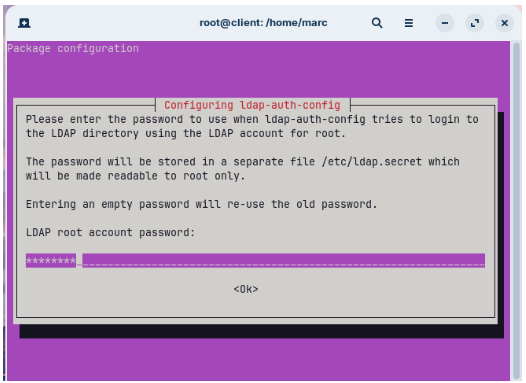

Un cop acabada la configuració farem la segunt comanda per confirmar que tot esta correctament 

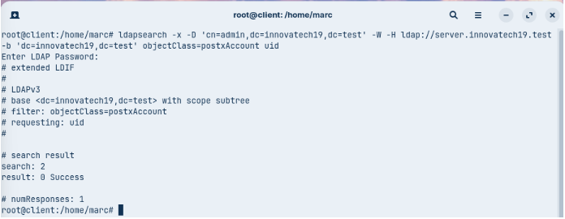

Un cop que ja hem comprobat que ens podem conectar haurem de modificar el seguent arxiu per indicar es fara servir ldap per els usuaris i grups

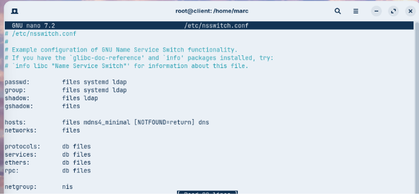

Ara toca editar l’arxiu /etc/pam.d/common-password per deixar-lo tal i com esta a la imatge en el qual s’ha de borrar el use\_authtok

Un cop fet aixo editem el seguent archiu i al final de tot afegirem la segunet linia tal i com esta a la imatge

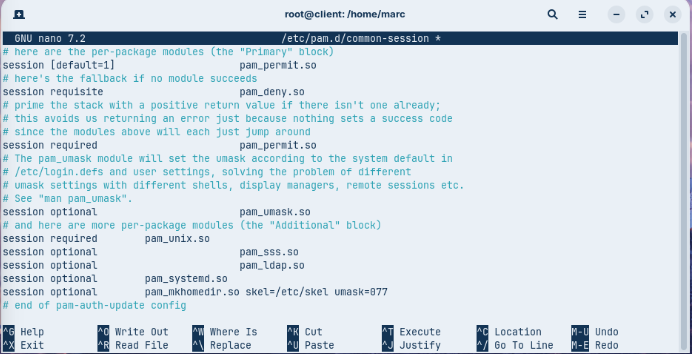

Un cop fet aixo reinciem el servei amb la comanda

I despres comprobem que podem veure els usuaris de ldap

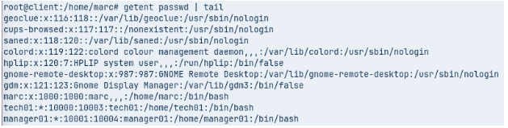

Ara per acabar editem l’arxiu per poder inicar sessio amb els usuaris de ldap desde l’entorn grafic

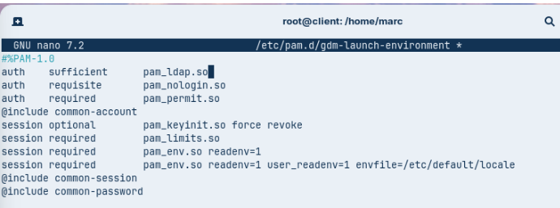

Un cop que ja tenim tot fet reiniciarem la maquina per comprobar que podem iniciar sessió amb els usuaris del ldap.

Escollit la opció de “Not listed?” per poder colocar el usuari i contrasenya

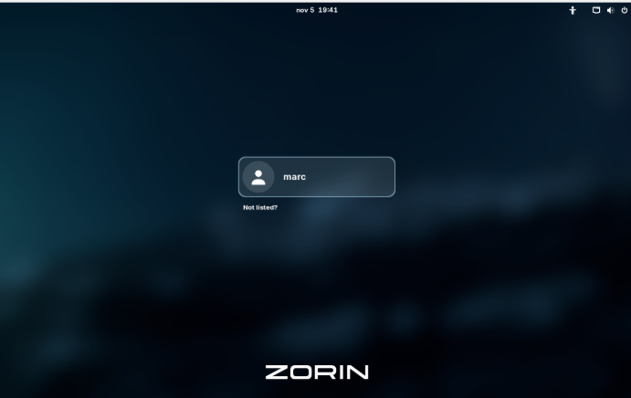

En aquest cas he escollit tech01 per fer la prova

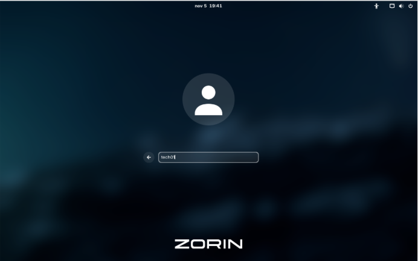

Un cop que hem col·locat el user col·loquem la contrasenya que tinguem, en aquest cas la contrasenya és 1234

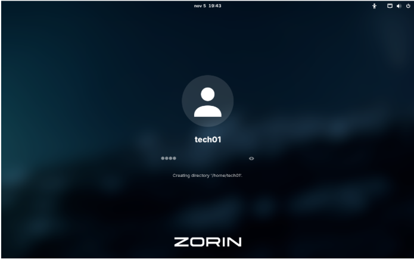

Per últim dins de la terminal fem servir la comanda “id” per poder comprobar que te els grups correctament assignats tal i com els hem configurat avans

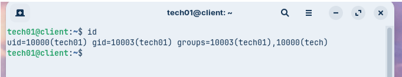
