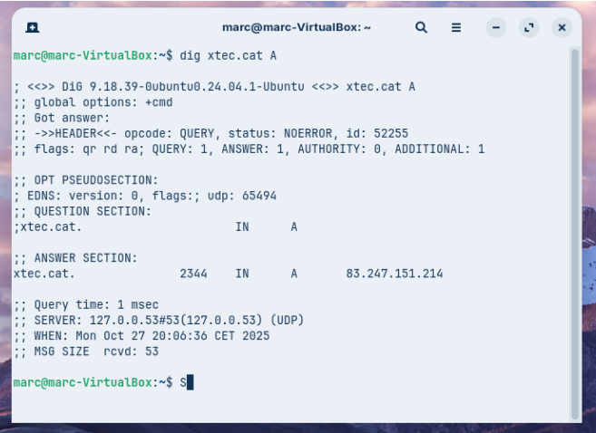
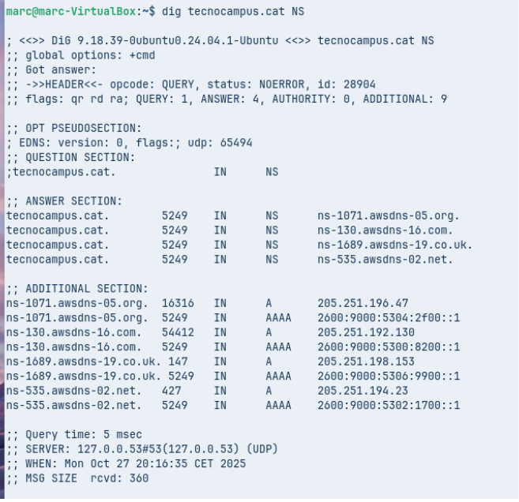
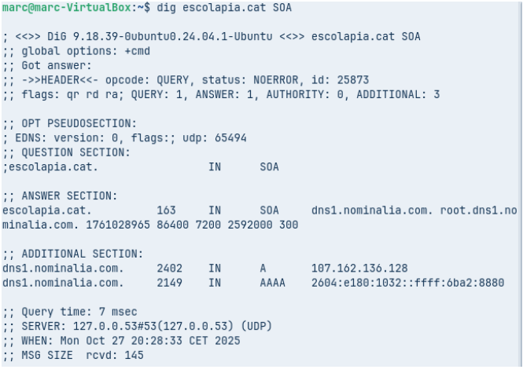
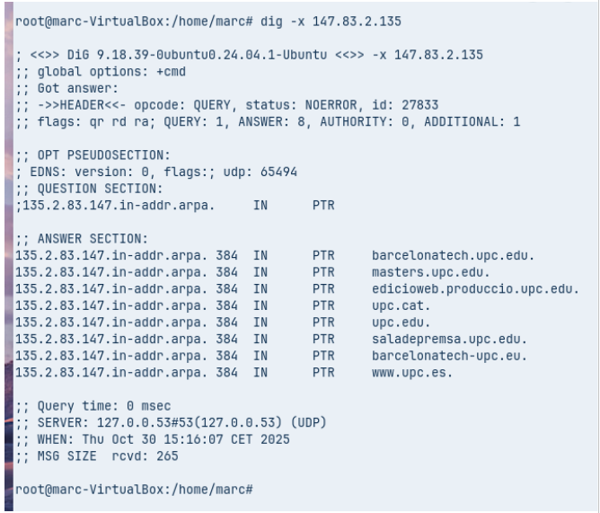
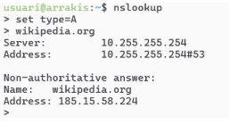
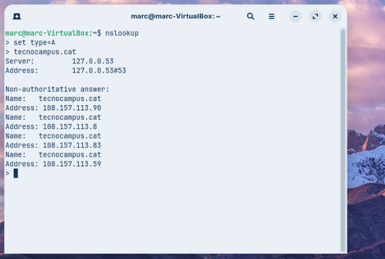
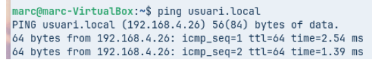

#### 

* **Comanda 1: Consulta Bàsica de Registre A**  
  * Executa dig xtec.cat A  
     
  * Anàlisi: Identifica la IP de resposta, el valor TTL i el servidor que ha respost a la consulta.

 Tenim que la IP de resposta és 83.247.151.214 el seu TTL és de 2344 segons i el seu servidor de resposta és 127.0.0.53.

* **Comanda 2: Consulta de Servidors de Noms (NS)**  
  * Executa dig tecnocampus.cat NS  
     
  * Anàlisi: Quins són els servidors de noms autoritatius per a aquest domini?  
    Hi ha 4 i són   
    [ns-1071.awsdns-05.org](http://ns-1071.awsdns-05.org).  
    [ns-130.awsdns-16.com](http://ns.130.awsdns-16.com).  
    [ns-1689-19.co.uk](http://ns-1689-19.co.uk)  
    [ns-535.awsdns-02.net](http://ns-535.awsdns-02.net).  
      
    

    
* **Comanda 3: Consulta Detallada SOA**  
  * Executa dig escolapia.cat SOA

  

* Anàlisi: Quina és la informació del correu de l'administrador i el número de sèrie del domini?  
  La informació del correu és que el correu de l'administrador és [root@dns.nominalia.com](mailto:root@dns.nominalia.com) i el seu número de sèrie és 1761028965 86400 7200 2592000 300       
* **Comanda 4: Consulta resolució inversa**  
  * Executa comanda dig \-x 147.83.2.135  
      
  * Anàlisi: Quina informació sobre els registres s’obté?

    Bàsicament, ens indica que una mateixa IP pot tindre diferents domini, en aquest cas podem veure que està associat per exemple a [barcelonatech.upc.edu](http://barcelonatech.upc.edu) entre altres podem veure que aquesta IP està bastant relacionada amb la Upc
**Comprovació de Resolució amb nslookup (Multiplataforma)**

L’eina nslookup es troba a pràcticament a qualsevol sistema operatiu. Es pot usar de forma similar a dig incloent l’argument o si s’executa nslookup sense arguments, entrar en el mode interactiu, us apareix un prompt (\>). Serà aquest mode el que explorareu . 

 

El mode és força senzill, bàsicament hi ha tres comandes a usar:

* **set type=** per indicar el tipus de consulta: A, AAA, MX, NS, SOA, TXT o ALL.  
* **server** **IP** on IP és la IP del servidor de noms al que es vol fer la consulta, també es pot indicar el nom del servidor enlloc de la IP, per exemple, server a9-66.akam.net.  
* **exit** que serveix per sortir de la comanda.  
* **Comanda 1: Consulta Bàsica no Autoritativa**  
  * Seleccionar *type=A* i com a domini de consulta tecnocampus.cat

 

* Anàlisi: Per què indica que la resposta és no autoritativa?

  Per que el servidor que fa la resposta no és el servidor autoritatiu perquè una resposta autoritativa únicament la poden donar els servidors que tenen la informació original.

  

  **Comanda 2: Consultes autoritatives**

  * Escriure *server IP* i escriure la IP del primer servidor de noms del domini tecnocampus.cat que s’ha obtingut d’una consulta anterior. A continuació, indiqueu que voleu consultar registres de tipus A i del domini tecnocampus.cat

 

* Anàlisi: Quines diferències s’observen a la resposta obtinguda amb la comanda 1?

  Podem veure que la diferència és que la resposta és autoritativa, això és perquè abans de fer el nslookup ens hem connectat al servidor autoritatiu de tecnocampus

**Resolucions locals**

Finalment es vol comprovar el funcionament de la resolució local, útil per entorns de xarxa local on no es disposa de servidor de noms propi i que evita haver d’accedir a equips o recursos per la seva IP.

Per poder fer la resolució local hem de fer servir un adaptador pont per poder comunicar-nos amb l’ordinador d’un company fent un ping, en aquest cas la maquina del company és diu usuari he fet un ping usuari.local, fent que pugui fer un ping sense ip

 

