# Bitwarden

## Instal·lació de Bitwarden

Per començar a instal·lar Bitwarden, ho podem fer des de la pàgina oficial o a través de la Microsoft Store.  
En aquest cas ho farem a través de la Microsoft Store; únicament haurem de clicar el botó blau que posa **“Instal·lar”** i ja està.

🔗 [Pàgina oficial de descàrrega](https://bitwarden.com/download/#downloads-desktop)  
🔗 [Microsoft Store](https://apps.microsoft.com/detail/9pjsdv0vpk04?hl=ca&gl=ES&ocid=pdpshare)

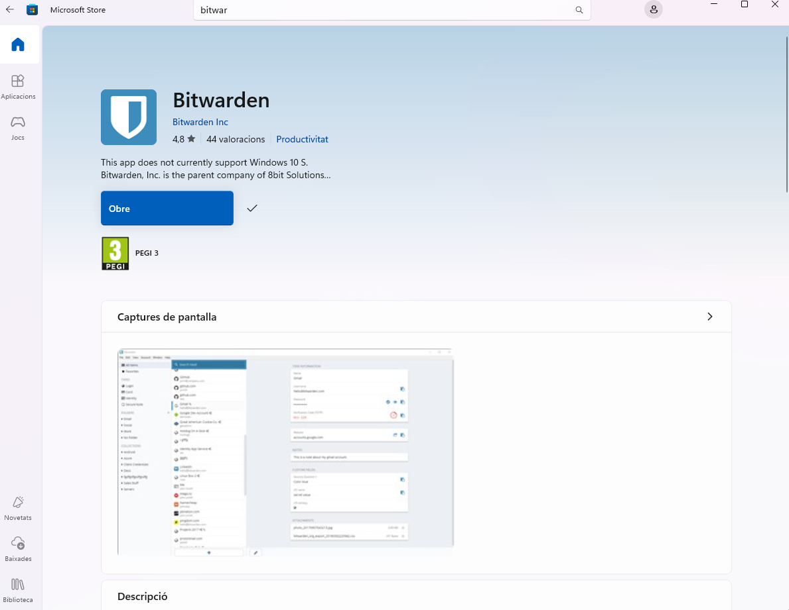

### Crear un compte

Un cop obert Bitwarden, sortirà aquesta pantalla:  
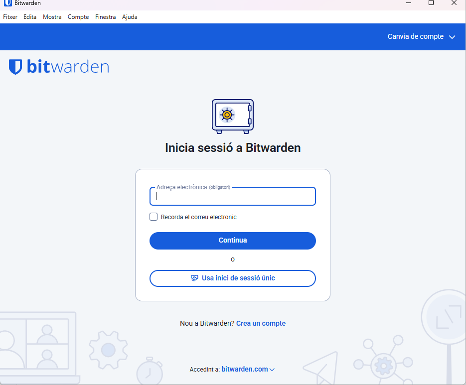

Un cop fet això tindrem això hem de col·locar un compte de correu i un nom per poder accedir al compte.
 
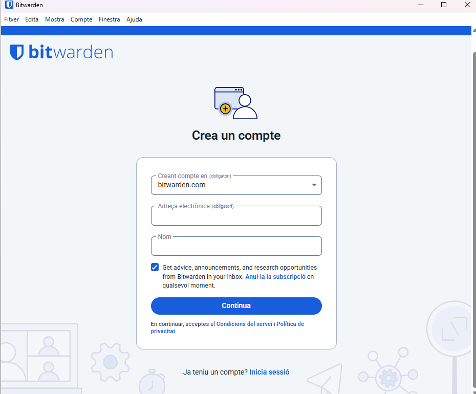

Un com que hem introduït el compte de correu i hem escollit un nom haurem d’anar al correu a buscar l'enllaç tal com ens indica Bitwarden.

Un cop que hem trobat el correu farem clic a l'enllaç per poder anar a l'enllaç per poder escollir la contrasenya del nostre compte.
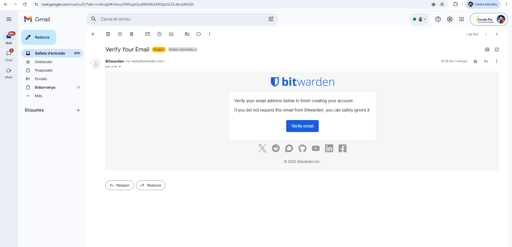

### Escollir la contrasenya mestra

Un cop aquí haurem d’escollir la nostra contrasenya mestra, és IMPORTANT la contrasenya mestra no es pot recuperar, per tant, si oblidem la contrasenya perdrem l'accés al nostre gestor de contrasenyes, per tant, també perdrem totes les contrasenyes.

Per intentar evitar això podem afegir una pista per poder recordar la contrasenya en cas que oblidem, hem d’escollir una contrasenya forta, però que la podem recordar.
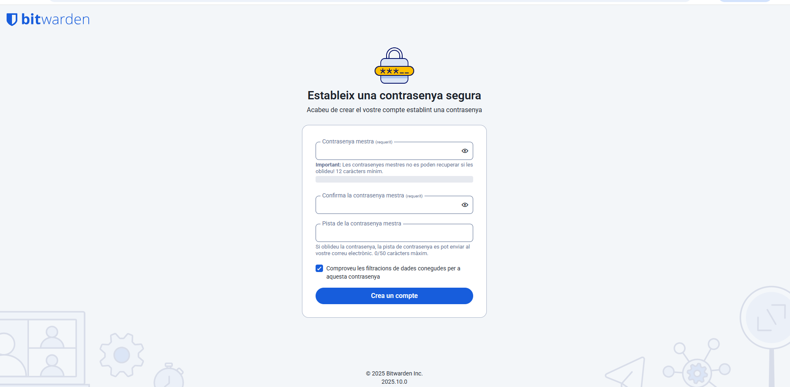

Un cop que ja hem escollit la nostra contrasenya podrem veure una notificació dient que el nostre compte s’ha creat correctament.

Bitwarden ens dona l'opció d'instal·lar una extensió de Google per poder accedir amb més comoditat a les contrasenyes i poder fer servir funció d'autocompletar les contrasenyes d’una forma més fàcil, però fer això ja és decisió de l'usuari en qüestió.
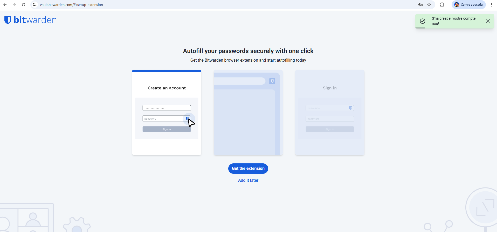

### Inici de sessió

Un cop fet això ja podem tornar a l’aplicació i fer clic on posa inicia sessió, ja que, ja hem creat el nostre compte.

Introduïm el **correu electrònic** i fem clic a **“Continua”**.  
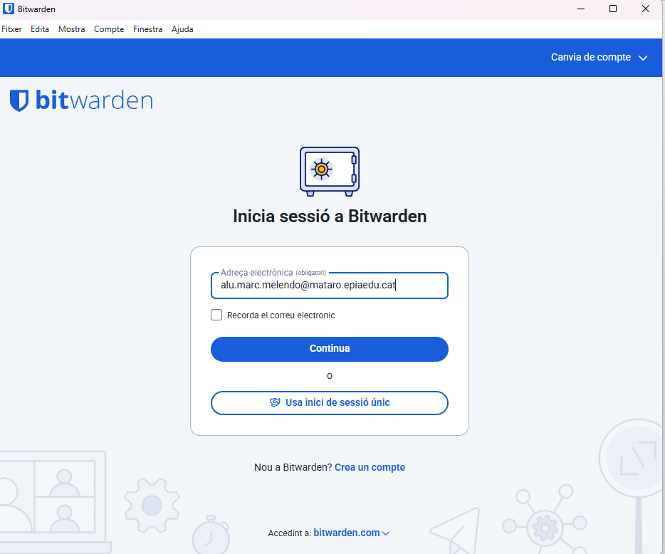

A continuació, escrivim la **contrasenya mestra**.  
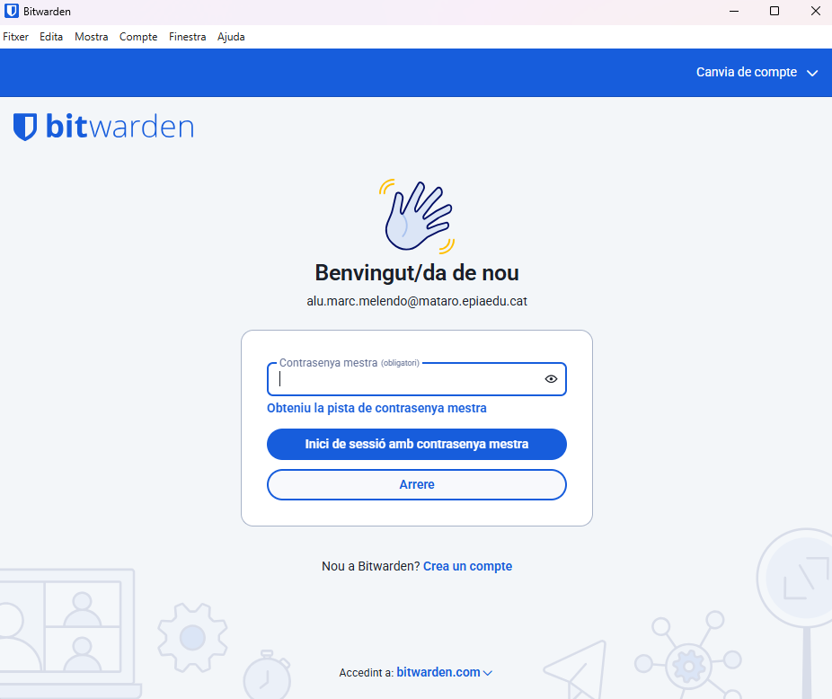

Un cop introduïdes les dades, ja estarem dins del nostre compte.  
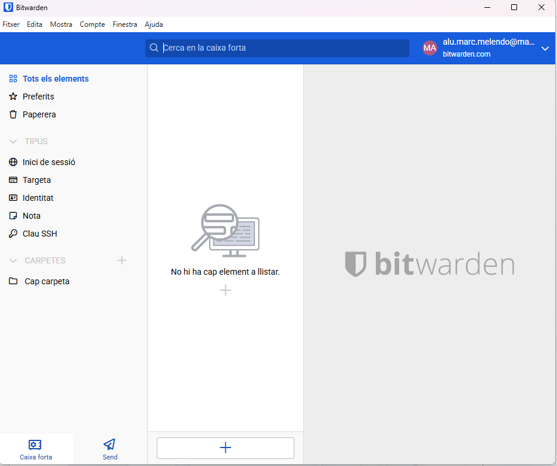

## Generar una contrasenya forta

Ara explicaré com generar una contrasenya forta.

Podem escollir la longitud quins caràcters volem que inclogui i el mínim de números i caràcters especials tingui, un cop fet això si fem clic a la rodeta del costat es genera una nova contrasenya i l’altre botó és per copiar la contrasenya. 

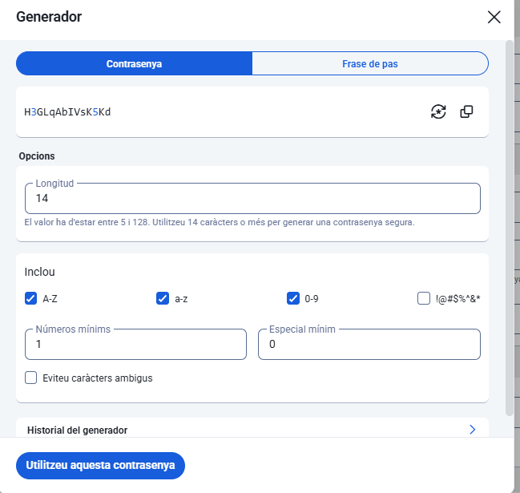

## Afegir la primera contrasenya

Ara per poder afegir el nostre primera conta i contrasenya haurem d’anar al \+ i escollir l'opció d'inici de sessió.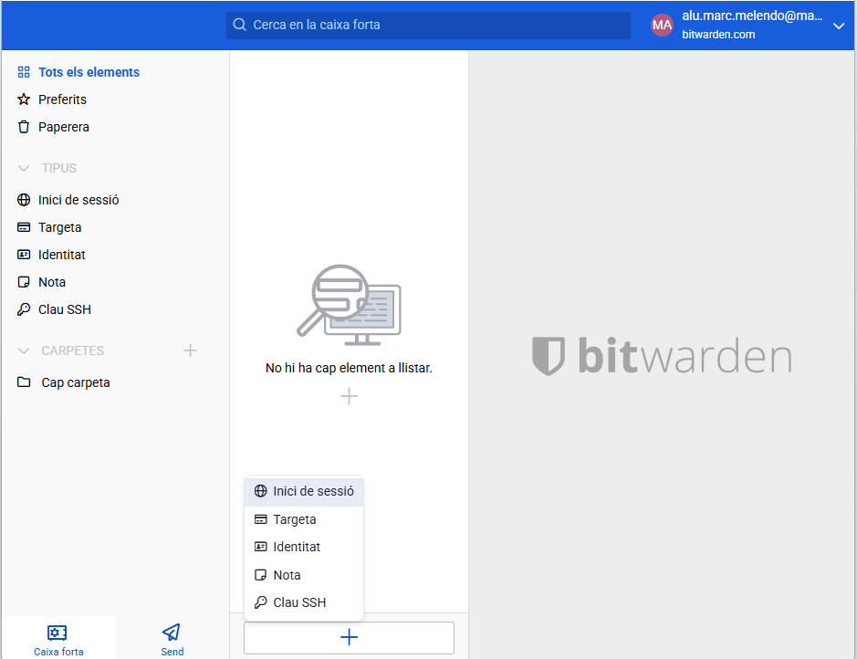

Un cop que tenim això obert haurem de completar els espais en buit, el nom d’element serà un nom per poder saber de què és el compte que estem guardant, per exemple Gmail o GitHub…

Tot seguit haurem de col·locar l’usuari i contrasenya del compte podem afegir la contrasenya si ja és un compte creada prèviament o podem generar la contrasenya fent clic a la rodeta al costat de l’ull de contrasenya.

I per últim el lloc web serà l'enllaç de el compte que estem guardant, per exemple [gmail](https://accounts.google.com/v3/signin/identifier?dsh=S-1977065783%3A1761227768212796&hl=es&ifkv=AfYwgwXe-zsOx6HI3HF5v1SOoNkDtSJHa1LAp3jHmfYvpiXY_fAQmpU8kgaSHePBY5GTmCjneZVK&service=mail&flowName=GlifWebSignIn&flowEntry=ServiceLogin)

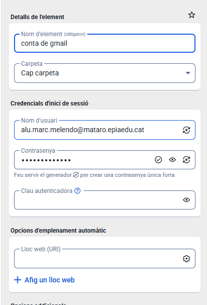

## Instal·lar l’extensió de Google Chrome

Ara mostraré com fer servir l'extensió de Google, per començar haurem d'instal·lar a mitjançant aquest [enllaç](https://chromewebstore.google.com/detail/bitwarden-gestor-de-contr/nngceckbapebfimnlniiiahkandclblb?hl=ca&utm_source=ext_sidebar)

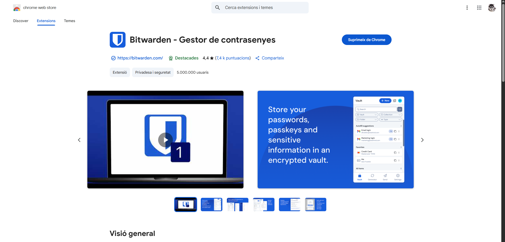

Un cop instal·lada, obrim-la i iniciem sessió.  
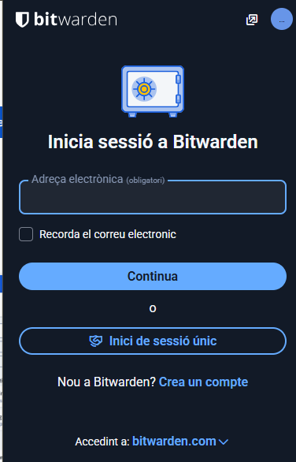

Quan iniciem sessió a Gmail, veurem que Bitwarden ens ofereix l’opció d’**autocompletar**.  
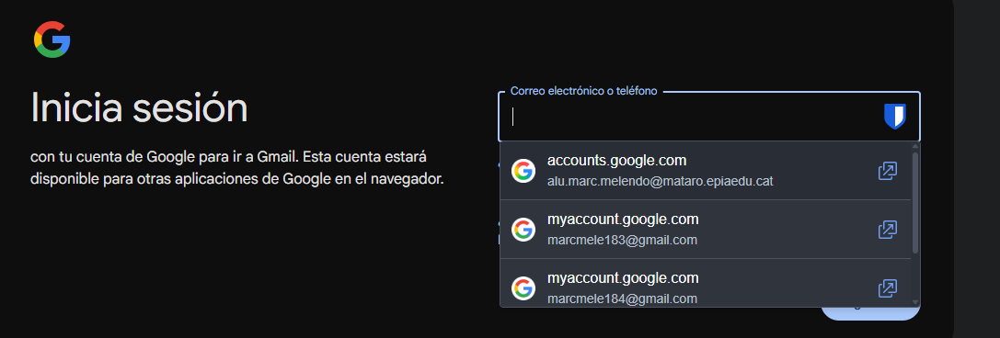

## Exportar contrasenyes

Per exportar totes les contrasenyes:

1. Anem a **Fitxer → Exportar caixa forta**  
   *(la “caixa forta” és on s’emmagatzemen totes les contrasenyes)*  
   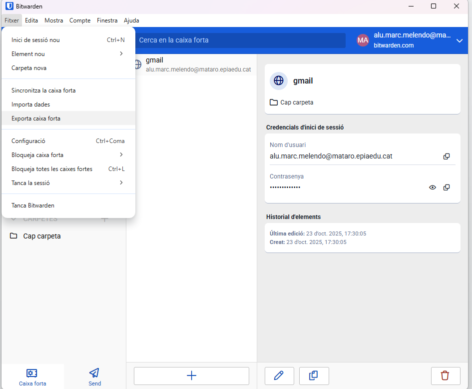  
2. Escollim el **format** amb el qual volem exportar-les (.json, .csv, etc.)  
   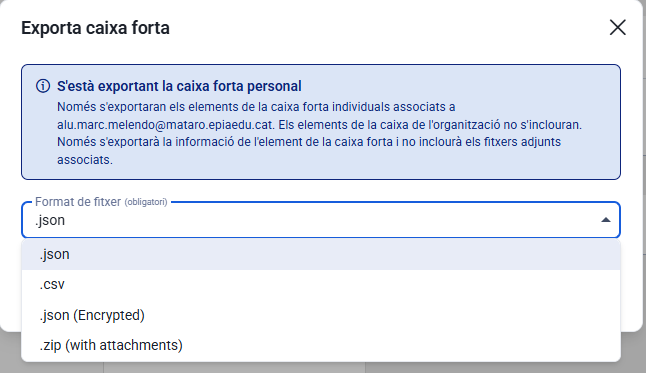
3. Ens demanarà la **contrasenya mestra** per confirmar la identitat.  
   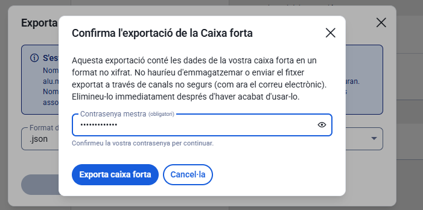
4. Ja tindrem les contrasenyes exportades.
  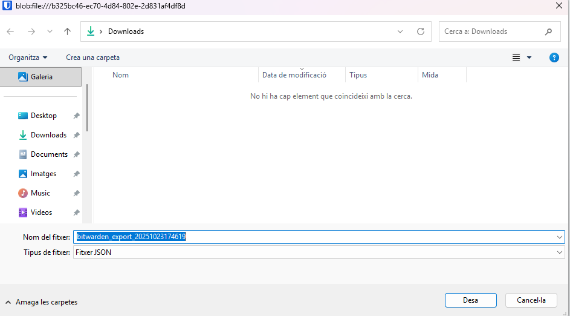
   

Per acabar, hem de guardar aquest arxiu en algun lloc segur perquè ningú pugui accedir a les nostres contrasenyes, per mi personalment la millor opció és un USB xifrat, ja que si sempre el portem amb nosaltres no ens podran robar l’arxiu, i en cas que el robin el USB estarà xifrat.

